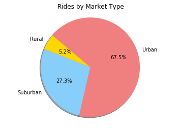
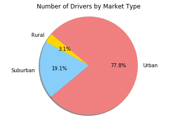
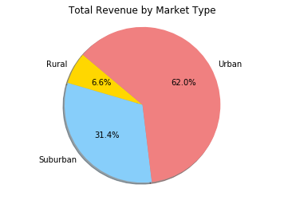

```python
import pandas as pd
import csv
import matplotlib.pyplot as plt
import numpy as np
```


```python
city_data = 'raw_data/city_data.csv'
ride_data = 'raw_data/ride_data.csv'
```


```python
city_data_df = pd.read_csv(city_data)
ride_data_df = pd.read_csv(ride_data)
```


```python
ride_data_df.head()
```


<div>
<style>
    .dataframe thead tr:only-child th {
        text-align: right;
    }

    .dataframe thead th {
        text-align: left;
    }

    .dataframe tbody tr th {
        vertical-align: top;
    }
</style>
<table border="1" class="dataframe">
  <thead>
    <tr style="text-align: right;">
      <th></th>
      <th>city</th>
      <th>date</th>
      <th>fare</th>
      <th>ride_id</th>
    </tr>
  </thead>
  <tbody>
    <tr>
      <th>0</th>
      <td>Sarabury</td>
      <td>2016-01-16 13:49:27</td>
      <td>38.35</td>
      <td>5403689035038</td>
    </tr>
    <tr>
      <th>1</th>
      <td>South Roy</td>
      <td>2016-01-02 18:42:34</td>
      <td>17.49</td>
      <td>4036272335942</td>
    </tr>
    <tr>
      <th>2</th>
      <td>Wiseborough</td>
      <td>2016-01-21 17:35:29</td>
      <td>44.18</td>
      <td>3645042422587</td>
    </tr>
    <tr>
      <th>3</th>
      <td>Spencertown</td>
      <td>2016-07-31 14:53:22</td>
      <td>6.87</td>
      <td>2242596575892</td>
    </tr>
    <tr>
      <th>4</th>
      <td>Nguyenbury</td>
      <td>2016-07-09 04:42:44</td>
      <td>6.28</td>
      <td>1543057793673</td>
    </tr>
  </tbody>
</table>
</div>


```python
grp_city_data = ride_data_df.groupby(['city'])
```


```python
cities_ride_count_df = pd.DataFrame(grp_city_data['ride_id'].count())
cities_ride_count_df.rename(columns={'ride_id':'number_of_rides'}, inplace=True)
avg_city_fare_df = pd.DataFrame(grp_city_data['fare'].mean())
avg_city_fare_df.rename(columns={'fare':'average_fare'}, inplace=True)
city_revenue_df = pd.DataFrame(grp_city_data['fare'].sum())
city_revenue_df.rename(columns={'fare':'total_fares'}, inplace=True)
```


```python
adj_city_data_df = city_data_df.set_index(['city'])
adj_city_data_df.head()
```


<div>
<style>
    .dataframe thead tr:only-child th {
        text-align: right;
    }

    .dataframe thead th {
        text-align: left;
    }

    .dataframe tbody tr th {
        vertical-align: top;
    }
</style>
<table border="1" class="dataframe">
  <thead>
    <tr style="text-align: right;">
      <th></th>
      <th>driver_count</th>
      <th>type</th>
    </tr>
    <tr>
      <th>city</th>
      <th></th>
      <th></th>
    </tr>
  </thead>
  <tbody>
    <tr>
      <th>Kelseyland</th>
      <td>63</td>
      <td>Urban</td>
    </tr>
    <tr>
      <th>Nguyenbury</th>
      <td>8</td>
      <td>Urban</td>
    </tr>
    <tr>
      <th>East Douglas</th>
      <td>12</td>
      <td>Urban</td>
    </tr>
    <tr>
      <th>West Dawnfurt</th>
      <td>34</td>
      <td>Urban</td>
    </tr>
    <tr>
      <th>Rodriguezburgh</th>
      <td>52</td>
      <td>Urban</td>
    </tr>
  </tbody>
</table>
</div>


```python
comb_city_data_df = cities_ride_count_df.join(avg_city_fare_df, how='outer').join(adj_city_data_df, how='outer').join(city_revenue_df, how='outer')
comb_city_data_df.head()
```


<div>
<style>
    .dataframe thead tr:only-child th {
        text-align: right;
    }

    .dataframe thead th {
        text-align: left;
    }

    .dataframe tbody tr th {
        vertical-align: top;
    }
</style>
<table border="1" class="dataframe">
  <thead>
    <tr style="text-align: right;">
      <th></th>
      <th>number_of_rides</th>
      <th>average_fare</th>
      <th>driver_count</th>
      <th>type</th>
      <th>total_fares</th>
    </tr>
    <tr>
      <th>city</th>
      <th></th>
      <th></th>
      <th></th>
      <th></th>
      <th></th>
    </tr>
  </thead>
  <tbody>
    <tr>
      <th>Alvarezhaven</th>
      <td>31</td>
      <td>23.928710</td>
      <td>21</td>
      <td>Urban</td>
      <td>741.79</td>
    </tr>
    <tr>
      <th>Alyssaberg</th>
      <td>26</td>
      <td>20.609615</td>
      <td>67</td>
      <td>Urban</td>
      <td>535.85</td>
    </tr>
    <tr>
      <th>Anitamouth</th>
      <td>9</td>
      <td>37.315556</td>
      <td>16</td>
      <td>Suburban</td>
      <td>335.84</td>
    </tr>
    <tr>
      <th>Antoniomouth</th>
      <td>22</td>
      <td>23.625000</td>
      <td>21</td>
      <td>Urban</td>
      <td>519.75</td>
    </tr>
    <tr>
      <th>Aprilchester</th>
      <td>19</td>
      <td>21.981579</td>
      <td>49</td>
      <td>Urban</td>
      <td>417.65</td>
    </tr>
  </tbody>
</table>
</div>


```python
adj_comb_city_data_df = comb_city_data_df.reset_index()
adj_comb_city_data_df.head()
```


<div>
<style>
    .dataframe thead tr:only-child th {
        text-align: right;
    }

    .dataframe thead th {
        text-align: left;
    }

    .dataframe tbody tr th {
        vertical-align: top;
    }
</style>
<table border="1" class="dataframe">
  <thead>
    <tr style="text-align: right;">
      <th></th>
      <th>city</th>
      <th>number_of_rides</th>
      <th>average_fare</th>
      <th>driver_count</th>
      <th>type</th>
      <th>total_fares</th>
    </tr>
  </thead>
  <tbody>
    <tr>
      <th>0</th>
      <td>Alvarezhaven</td>
      <td>31</td>
      <td>23.928710</td>
      <td>21</td>
      <td>Urban</td>
      <td>741.79</td>
    </tr>
    <tr>
      <th>1</th>
      <td>Alyssaberg</td>
      <td>26</td>
      <td>20.609615</td>
      <td>67</td>
      <td>Urban</td>
      <td>535.85</td>
    </tr>
    <tr>
      <th>2</th>
      <td>Anitamouth</td>
      <td>9</td>
      <td>37.315556</td>
      <td>16</td>
      <td>Suburban</td>
      <td>335.84</td>
    </tr>
    <tr>
      <th>3</th>
      <td>Antoniomouth</td>
      <td>22</td>
      <td>23.625000</td>
      <td>21</td>
      <td>Urban</td>
      <td>519.75</td>
    </tr>
    <tr>
      <th>4</th>
      <td>Aprilchester</td>
      <td>19</td>
      <td>21.981579</td>
      <td>49</td>
      <td>Urban</td>
      <td>417.65</td>
    </tr>
  </tbody>
</table>
</div>


```python
grp_mkt_type = adj_comb_city_data_df.groupby(['type'])
mkt_type_df = pd.DataFrame(grp_mkt_type['number_of_rides','driver_count','total_fares'].sum())
mkt_type_df
```


<div>
<style>
    .dataframe thead tr:only-child th {
        text-align: right;
    }

    .dataframe thead th {
        text-align: left;
    }

    .dataframe tbody tr th {
        vertical-align: top;
    }
</style>
<table border="1" class="dataframe">
  <thead>
    <tr style="text-align: right;">
      <th></th>
      <th>number_of_rides</th>
      <th>driver_count</th>
      <th>total_fares</th>
    </tr>
    <tr>
      <th>type</th>
      <th></th>
      <th></th>
      <th></th>
    </tr>
  </thead>
  <tbody>
    <tr>
      <th>Rural</th>
      <td>125</td>
      <td>104</td>
      <td>4255.09</td>
    </tr>
    <tr>
      <th>Suburban</th>
      <td>657</td>
      <td>638</td>
      <td>20335.69</td>
    </tr>
    <tr>
      <th>Urban</th>
      <td>1625</td>
      <td>2607</td>
      <td>40078.34</td>
    </tr>
  </tbody>
</table>
</div>


```python
total_revenue = round(ride_data_df['fare'].sum(),2)
total_rides = ride_data_df['ride_id'].count()
total_drivers = city_data_df['driver_count'].sum()
#print(f'Total Revenue is {total_revenue}')
#print(f'Total rides are {total_rides}')
#print(f'Total drivers are {total_drivers}')
```

    Total Revenue is 63651.31
    Total rides are 2375
    Total drivers are 3349
    


```python
market_type = mkt_type_df.index
numb_of_rides = mkt_type_df['number_of_rides']
drvr_count = mkt_type_df['driver_count']
mkt_typ_rev = mkt_type_df['total_fares']
colors = ['gold', 'lightskyblue', 'lightcoral']
```


```python
#Rides by market type
plt.pie(numb_of_rides, labels=market_type, colors=colors, autopct= '%1.1f%%', shadow=True, startangle=140)
plt.axis('equal')
plt.title('Rides by Market Type')
plt.show()
```





```python
#Total number of drives by market type
plt.pie(drvr_count, labels=market_type, colors=colors, autopct= '%1.1f%%', shadow=True, startangle=140)
plt.axis('equal')
plt.title('Number of Drivers by Market Type')
plt.show()
```





```python
# Total revenue by market type
plt.pie(mkt_typ_rev, labels=market_type, colors=colors, autopct= '%1.1f%%', shadow=True, startangle=140)
plt.axis('equal')
plt.title('Total Revenue by Market Type')
plt.show()
```




